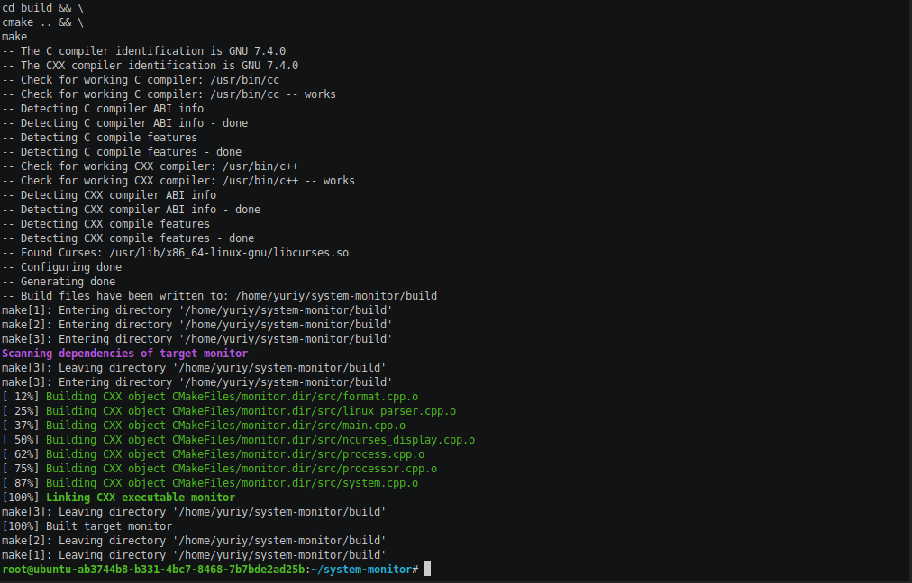

# System Monitor
Alternative to [htop](https://github.com/hishamhm/htop) command-line application process viewer for Linux distributives

*Ubuntu 18 with 4 CPU cores*

*Ubuntu 16 with 2 CPU cores*

## Table of Contents
* [Dependencies](https://github.com/jurayev/system-monitor#dependencies)
* [Installation](https://github.com/jurayev/system-monitor#installation)
* [Usage](https://github.com/jurayev/system-monitor#usage)
* [Demo](https://github.com/jurayev/system-monitor#demo)
* [Tests]()
* [License](https://github.com/jurayev/system-monitor#license)

## Dependencies
### ncurses
[ncurses](https://www.gnu.org/software/ncurses/) is a library that facilitates text-based graphical output in the terminal. This project relies on ncurses for display output.

Install ncurses within your own Linux environment: `sudo apt install libncurses5-dev libncursesw5-dev`

### Make
This project uses [Make](https://www.gnu.org/software/make/). The Makefile has four targets:
* `build` compiles the source code and generates an executable
* `format` applies [ClangFormat](https://clang.llvm.org/docs/ClangFormat.html) to style the source code
* `debug` compiles the source code and generates an executable, including debugging symbols
* `clean` deletes the `build/` directory, including all of the build artifacts

## Installation
*Watch installation demo*

1. Clone the project repository: `git clone https://github.com/jurayev/system-monitor.git`

2. Go to project folder: `cd system-monitor`

3. Build the project: `make build`

## Usage
### Demo
*Watch System Monitor demo*

### Execution
1. Run application: `./build/monitor`

2. Stop application by pressing: `ctrl + c`

## License

[The content of this repository is licensed under a MIT License.](https://github.com/jurayev/system-monitor/blob/master/LICENSE.md)
