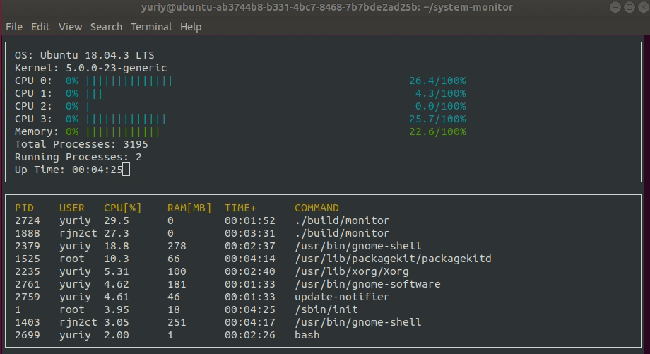
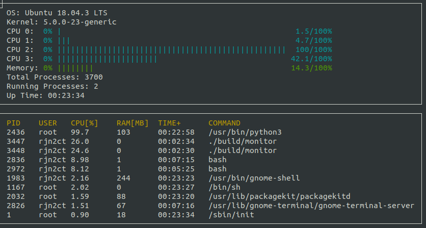
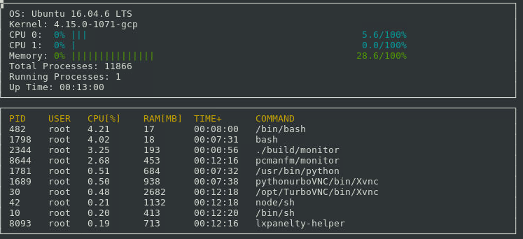

# System Monitor
Alternative to [htop](https://github.com/hishamhm/htop) command-line application process viewer for Linux distributives

## Live Demo

## Features

### System
 * Displays the system info: `OS and Kernel versions`
 * Calculates `CPU utilization` for each CPU core in %
 * Calculates `Memory utilization` in %
 * Displays `Total and Running Processes` info
 * Displays the system `Uptime`

### Processes
Displays top 10 processes based on process CPU utilization.

Processes window displays the following info: 
   * `PID` process ID
   * `USER` user name who runs this process
   * `CPU` process CPU utilization in %
   * `RAM` Memory utilization for process in megabytes
   * `TIME+` Up time of current process
   * `COMMAND` Command used to run this process. Maximum command length displayed is 50 chars.

*Ubuntu 18 with 4 CPU cores*

*Ubuntu 16 with 2 CPU cores*

## Dependencies
### ncurses
[ncurses](https://www.gnu.org/software/ncurses/) is a library that facilitates text-based graphical output in the terminal. This project relies on ncurses for display output.

Install ncurses within your own Linux environment: `sudo apt install libncurses5-dev libncursesw5-dev`

### Make
This project uses [Make](https://www.gnu.org/software/make/). The Makefile has four targets:
* `build` compiles the source code and generates an executable
* `format` applies [ClangFormat](https://clang.llvm.org/docs/ClangFormat.html) to style the source code
* `debug` compiles the source code and generates an executable, including debugging symbols
* `clean` deletes the `build/` directory, including all of the build artifacts

## Installation

1. Clone the project repository: `git clone https://github.com/jurayev/system-monitor.git`

2. Go to project folder: `cd system-monitor`

3. Build the project: `make build`

## Usage

### Execution
1. Run application: `./build/monitor`

2. Stop application: `ctrl + c`

## Roadmap

Future TODOs:
* Calculate Process CPU utilization dynamically, based on recent utilization
* Make the display interactive: Kill process, Sort by individual cell, Number of displayed processes.
* Restructure the program to use abstract classes (interfaces) and pure virtual functions
* Port the program to another operating system: MacOS, Windows
* Add unit tests

## Contributing
Pull requests are welcome. For major changes, please open an issue first to discuss what you would like to change.

Please make sure to update tests as appropriate.

## License

The content of this repository is licensed under a [MIT License.](https://github.com/jurayev/system-monitor/blob/master/LICENSE.md)
